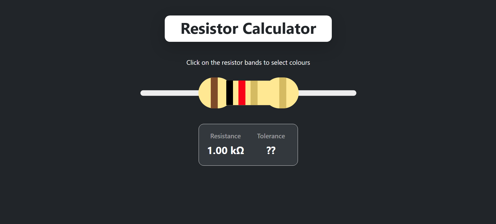
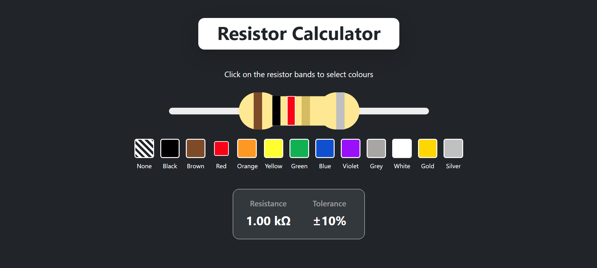
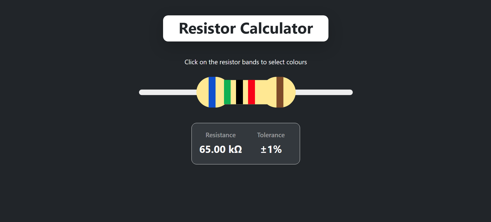
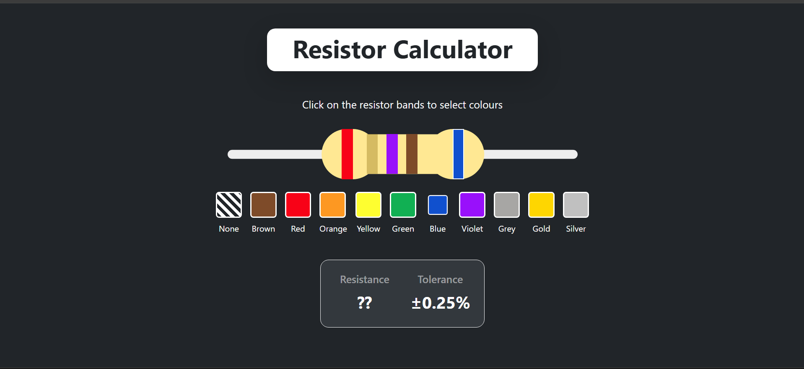
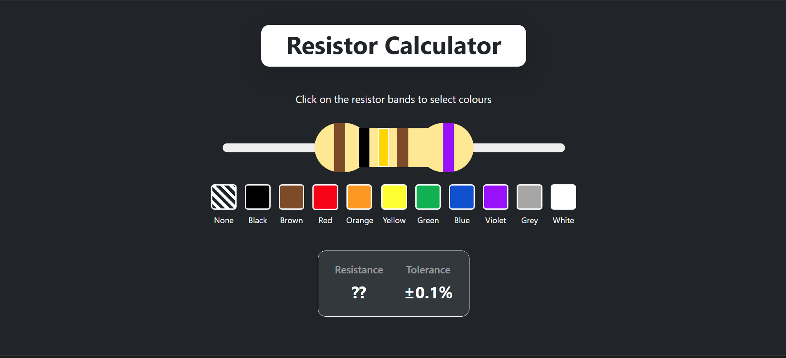

# Resistor Calculator
Made for ECES Software Bootcamp 2026 - Dev Vertical

To visit website [click here](https://05-arnav-gupta.github.io/RessistorCalculator/) or visit https://05-arnav-gupta.github.io/RessistorCalculator/

Supports all 3 bands, 4 bands and 5 bands ressistors. If bands are incorrectly chosen the Result will show ?? as an error.

## 3 Bands

## 4 Bands

## 5 Bands

## Edge Cases (Example)
When 1st, 2nd or 3rd bands are not set. Resistances cant be calculated

---
When invalid band colours are chosen. By default when 4th band is set to a colour it removes the extra colours present in 3rd band colour picker, so it cant be selected. But when 4th band is not chosen 3rd band acts as a multiplier so has extra options of Gold and Silver. If fourth band is chosen after picking gold and silver in 3rd it will no longer be a valid ressistance code as 3rd band is now only limited to the 10 digits. Hence it will fail to calculate.

